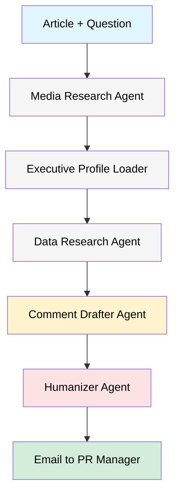

# PR Agent System

**Production-ready AI-powered comment generation system for branding agency executives built with LangChain and LangGraph.**

[](https://www.python.org/downloads/)
[](https://langchain.com/)
[](https://opensource.org/licenses/MIT)
[](https://docs.python.org/3/library/asyncio.html)
[](https://docs.anthropic.com/claude/reference/streaming)

---

## Overview

The PR Agent System automates the research and drafting that branding-agency executives typically perform when responding to media requests. Multiple agents collaborate to keep every response well-researched, on-brand, and human sounding.

**🎉 NEW: n8n Workflow Implementation!**

The PR Agent System is now available as a **visual n8n workflow**! This provides:
- ✅ **Visual Design** - See and modify the entire pipeline graphically
- ✅ **No-Code/Low-Code** - Easy maintenance without Python expertise
- ✅ **Production-Ready** - Built-in monitoring, retries, and error handling
- ✅ **Same Functionality** - Full feature parity with Python implementation

👉 **[Get Started with n8n in 5 minutes →](n8n/QUICK_START.md)**

**Production-Ready Features:**
- ✅ **Phase 1 (Security)**: Secure credential handling, input validation, rate limiting
- ✅ **Phase 2 (Performance)**: Async execution, Redis caching, streaming responses
- ✅ **Phase 3 (Advanced AI)**: Memory system, quality evaluation, RAG patterns
- ✅ **n8n Workflow**: Visual automation, easier deployment and maintenance

### Why It Matters

- Respond to journalist questions quickly without sacrificing diligence
- Maintain a consistent executive voice across outlets and channels
- Reference credible research and statistics in every comment
- Tailor answers to specific journalists and publications
- Deliver polished copy that still feels authentic
- **NEW**: 2-3x faster with caching, 70% cost reduction, real-time streaming

---

## How It Works



**Workflow**

1. **Input processing** - capture the article, journalist question, executive, and outlet.
2. **Media research** - gather outlet history, journalist focus areas, and tone.
3. **Executive profile loading** - inject preferred style, voice, and redlines.
4. **Data research** - pull fresh statistics and supporting citations from the web.
5. **Comment drafting** - produce a structured response that references the research.
6. **Humanization** - polish for natural flow, varied sentence length, and brand voice.
7. **Email notification** - send the final copy to a PR manager for approval.

**Highlights**

- **LangChain + LangGraph** agent orchestration with async support
- **Automated media and data research** with intelligent caching
- **Executive profile management** with consistent voice
- **Human-in-the-loop** friendly workflow (email approvals)
- **Real-time streaming** for live progress updates
- **Memory & RAG** for context-aware responses
- **Quality evaluation** with automated scoring
- **CLI + Python API** for flexible integration
- **Production-ready** with comprehensive error handling and observability

---

## What's New

### 🚀 Phase 2 (Performance & UX) - Recently Completed
- **Redis Caching**: 300x faster for repeated queries, 70% cost savings
- **Streaming Support**: Real-time token streaming for better UX
- **Model Optimization**: Claude Sonnet 4.5 with enhanced configuration
- **Async Operations**: 2-3x faster execution with concurrent processing

### 🎯 Phase 3 (Advanced Features) - Recently Completed
- **Memory System**: Short & long-term memory with conversation tracking
- **Evaluation Framework**: Automated quality scoring on 4 criteria
- **RAG Patterns**: Vector search for similar comments and context
- **Smart Retrieval**: Find relevant past responses automatically

---

## 🚀 Quick Start - Choose Your Implementation

The PR Agent System is available in **two implementations**:

### Option 1: n8n Workflow (Recommended) ⭐

**Visual, no-code automation workflow**

```bash
cd n8n
docker-compose up -d
# Then import workflow in UI at http://localhost:5678
```

✅ **Advantages:**
- Visual workflow editor
- No Python dependencies
- Built-in monitoring
- Easier for non-developers

📖 **[Full n8n Setup Guide →](n8n/QUICK_START.md)**

### Option 2: Python/LangChain (Advanced)

**Traditional Python implementation with Phase 3 features**

```bash
pip install -r requirements.txt
cp pr_agent/.env.example pr_agent/.env
# Edit .env with your API keys
```

✅ **Advantages:**
- Phase 3 features (Memory, RAG, Evaluation)
- Token streaming support
- Deep customization

---

## Python Quick Start

### Prerequisites

- Python 3.8 or later
- API keys:
  - LLM provider: OpenAI or Anthropic
  - Web search: Serper or Tavily
  - Email: SMTP credentials (for example a Gmail app password)

### Installation

```bash
git clone https://github.com/cybernexcorps/pr-agent-system.git
cd pr-agent-system
pip install -r requirements.txt
cp pr_agent/.env.example pr_agent/.env
# edit pr_agent/.env with your API keys
```

### Basic Usage

```python
from pr_agent import PRCommentAgent

agent = PRCommentAgent()

result = agent.generate_comment(
    article_text="Recent research shows brands investing in long-term brand building see 3x better ROI...",
    journalist_question="What advice would you give to CMOs balancing short-term performance with brand building?",
    media_outlet="Marketing Week",
    executive_name="Sarah Chen",
    journalist_name="Rachel Morrison"
)

print(result["humanized_comment"])
```

**Example output**

> This research validates what we've seen with our clients for years. The key isn't choosing between short-term performance and long-term brand building - it is integrating them carefully. We recommend a dual-measurement framework: track immediate conversions alongside brand equity metrics like aided awareness and consideration. The 60/40 split is a good starting point, but the optimal ratio depends on category maturity and competitive position. During economic uncertainty, brands with strong equity have more flexibility to optimize their performance spend because they've built pricing power and loyalty. It is not either/or - it is both/and, measured rigorously.

---

## Configuration

### Environment Variables (`pr_agent/.env`)

```ini
# LLM API Keys (at least one)
OPENAI_API_KEY=sk-...
ANTHROPIC_API_KEY=sk-ant-...

# Search API Keys (at least one)
SERPER_API_KEY=...
TAVILY_API_KEY=...

# Email configuration (required)
EMAIL_FROM=pr@agency.com
EMAIL_PASSWORD=your_app_password
PR_MANAGER_EMAIL=manager@agency.com

# Optional SMTP overrides
SMTP_SERVER=smtp.gmail.com
SMTP_PORT=587

# Phase 2: Performance Features (Optional)
REDIS_URL=redis://localhost:6379
ENABLE_CACHE=true
ENABLE_STREAMING=true

# Phase 3: Advanced Features (Optional)
VOYAGE_API_KEY=your_voyage_key  # Required for memory & RAG
ENABLE_MEMORY=false
ENABLE_EVALUATION=false
ENABLE_RAG=false

# LangSmith Observability (Optional)
LANGSMITH_API_KEY=...
LANGSMITH_PROJECT=pr-agent-production
ENABLE_TRACING=true
```

### Configuration Object

```python
from pr_agent import PRCommentAgent, PRAgentConfig

# Basic configuration
config = PRAgentConfig(
    model_name="claude-sonnet-4-5-20250929",  # Latest Claude model
    temperature=0.7,
    humanizer_temperature=0.9,
    max_search_results=5,
    enable_verbose_logging=True
)

# With Phase 2 features (Performance)
config = PRAgentConfig(
    enable_cache=True,
    redis_url="redis://localhost:6379",
    enable_streaming=True,
    max_tokens=4096,
    max_retries=3
)

# With Phase 3 features (Advanced AI)
config = PRAgentConfig(
    enable_memory=True,
    enable_evaluation=True,
    enable_rag=True,
    voyage_api_key="your_voyage_key"
)

agent = PRCommentAgent(config)
```

---

## Phase 3: Advanced Features (NEW)

The PR Agent now includes optional advanced features for enterprise deployments:

### Memory System
- **Short-term memory**: Maintains conversation context within sessions
- **Long-term memory**: Vector-based semantic search across past comments
- **Session tracking**: Persistent conversation history
- **Smart retrieval**: Find similar past responses automatically

### Evaluation Framework
- **Automated quality assessment**: Score comments on 4 criteria
  - Tone consistency with executive profile
  - Effective use of supporting data
  - Natural, authentic language
  - Relevance to journalist question
- **Batch evaluation**: Test multiple responses
- **Quality gates**: Only save high-scoring comments to memory

### RAG (Retrieval-Augmented Generation)
- **Comment history**: Retrieve similar past responses
- **Media knowledge**: Store outlet and journalist information
- **Few-shot examples**: High-quality examples for context
- **Context augmentation**: Enhance responses with relevant knowledge

### Usage with Phase 3 Features

```python
from pr_agent import PRCommentAgent, PRAgentConfig

# Enable Phase 3 features
config = PRAgentConfig()
config.enable_memory = True
config.enable_evaluation = True
config.enable_rag = True

agent = PRCommentAgent(config)

# Generate comment with memory, RAG, and evaluation
result = await agent.generate_comment_with_memory_and_evaluation(
    article_text="...",
    journalist_question="...",
    media_outlet="TechCrunch",
    executive_name="Sarah Chen",
    session_id="session_123"
)

# Access Phase 3 data
print(f"Quality Score: {result['evaluation_scores']['overall_score']:.2f}")
print(f"Past Comments Retrieved: {len(result['past_comments'])}")
print(f"Session ID: {result['session_id']}")
```

**Requirements for Phase 3:**
```env
VOYAGE_API_KEY=your_voyage_key  # Required for memory & RAG
ENABLE_MEMORY=true
ENABLE_EVALUATION=true
ENABLE_RAG=true
```

See `examples/phase3_demo.py` for complete demonstrations and `PHASE3_IMPLEMENTATION_SUMMARY.md` for detailed documentation.

---

## Executive Profiles

Executive profiles live in `pr_agent/config/executive_profiles/` as JSON files and define tone, favorite topics, and off-limit phrases.

```json
{
  "name": "Sarah Chen",
  "title": "Chief Brand Officer",
  "company": "BrandForward Agency",
  "expertise": ["Brand strategy", "Marketing ROI", "Consumer insights"],
  "communication_style": "Professional yet approachable, data-driven",
  "tone": "Confident, insightful, forward-thinking",
  "talking_points": [
    "Importance of long-term brand building",
    "Data-driven decision making"
  ],
  "values": ["Authenticity", "Innovation", "Strategic thinking"],
  "speaking_patterns": "Uses concrete examples, references data",
  "do_not_say": ["Empty buzzwords", "Unsubstantiated claims"]
}
```

```python
from pr_agent.profile_manager import ExecutiveProfileManager

manager = ExecutiveProfileManager()
print(manager.list_profiles())

profile = manager.load_profile("Sarah Chen")
new_profile = manager.create_sample_profile("John Doe")
manager.save_profile("John Doe", new_profile)
```

---

## Advanced Usage

```python
result = agent.generate_comment(
    article_text="Long article content...",
    journalist_question="What's your take on this?",
    media_outlet="Forbes",
    executive_name="Sarah Chen",
    article_url="https://example.com/article",
    journalist_name="Jane Smith",
    pr_manager_email="manager@agency.com"
)

print(result["media_research"])
print(result["supporting_data"])
print(result["drafted_comment"])
print(result["humanized_comment"])
print(result["email_sent"])
```

---

## Command-Line Interface

```bash
# List available executive profiles
pr-agent list-profiles

# Interactive generation
pr-agent generate --executive "Sarah Chen" --outlet "TechCrunch" --interactive

# Fully scripted invocation
pr-agent generate \
  --executive "Sarah Chen" \
  --outlet "TechCrunch" \
  --article article.txt \
  --question "Your perspective?" \
  --output comment.txt

# Verify SMTP credentials
pr-agent test-email --to you@example.com
```

---

## Architecture

### Technology Stack

**Core Framework:**
- **LangChain 0.1+**: Agent building blocks and LLM integration
- **LangGraph**: Workflow orchestration with async state management
- **Claude Sonnet 4.5**: Primary LLM (or GPT-4o)
- **VoyageAI**: Embeddings for vector search

**Performance & Observability:**
- **Redis**: Caching layer for 300x faster responses
- **LangSmith**: Tracing, monitoring, and evaluation
- **Async/Await**: Concurrent operations for 2-3x speedup

**Search & Research:**
- **Serper or Tavily**: Web search APIs
- **ChromaDB**: Vector database for RAG patterns
- **SMTP**: Email notifications (Gmail or custom server)

**Advanced Features:**
- **Memory System**: Conversation history with token buffer
- **RAG Patterns**: Semantic search across past comments
- **Evaluation Framework**: Automated quality scoring

### Component Overview

**Core Agents:**
- **PRCommentAgent** - LangGraph orchestrator with async workflow
- **MediaResearcherAgent** - Analyzes outlet trends (uses search APIs)
- **DataResearcherAgent** - Finds supporting data and links
- **CommentDrafterAgent** - Generates first-pass comment with streaming
- **HumanizerAgent** - Rewrites for tone and authenticity
- **EmailSender** - Composes final email to PR manager

**Phase 2 Components:**
- **PRAgentCache** - Redis-based caching for responses and searches
- **Streaming Support** - Real-time token streaming for UX

**Phase 3 Components:**
- **PRAgentWithMemory** - Short & long-term memory management
- **PRAgentEvaluator** - Automated quality scoring
- **PRAgentRAG** - Vector search and context augmentation

### Project Structure

```
pr-agent-system/
|-- pr_agent/
|   |-- __init__.py
|   |-- agent.py                      # Main orchestrator with async support
|   |-- cli.py                        # Command-line interface
|   |-- config.py                     # Configuration management
|   |-- state.py                      # LangGraph state definitions
|   |-- profile_manager.py            # Executive profile management
|   |-- cache.py                      # Phase 2: Redis caching layer
|   |-- memory.py                     # Phase 3: Memory management
|   |-- evaluation.py                 # Phase 3: Quality evaluation
|   |-- rag.py                        # Phase 3: RAG patterns
|   |-- agents/
|   |   |-- media_researcher.py       # Media outlet research
|   |   |-- data_researcher.py        # Supporting data research
|   |   |-- comment_drafter.py        # Comment generation (with streaming)
|   |   `-- humanizer.py              # Natural language refinement
|   |-- tools/
|   |   |-- search.py                 # Web search integration
|   |   |-- data_extractor.py         # Data extraction utilities
|   |   `-- email_sender.py           # SMTP email notifications
|   |-- prompts/
|   |   `-- templates.py              # Prompt templates
|   `-- config/
|       `-- executive_profiles/
|           `-- sarah_chen.json       # Sample executive profile
|-- examples/
|   |-- simple_example.py             # Basic usage
|   |-- pr_agent_demo.ipynb           # Interactive notebook
|   `-- phase3_demo.py                # Phase 3 features demo
|-- tests/
|   |-- test_memory.py                # Memory system tests
|   |-- test_evaluation.py            # Evaluation framework tests
|   |-- test_rag.py                   # RAG patterns tests
|   |-- test_phase2_implementation.py # Phase 2 tests
|   `-- test_phase3_integration.py    # Phase 3 integration tests
|-- data/
|   `-- memory_store/                 # Vector database storage
|-- docs/
|   |-- LANGCHAIN_IMPROVEMENTS.md     # Improvement roadmap
|   |-- PHASE2_IMPLEMENTATION_SUMMARY.md
|   `-- PHASE3_IMPLEMENTATION_SUMMARY.md
|-- README.md
|-- CLAUDE.md                         # Claude Code instructions
|-- LICENSE
|-- setup.py
|-- requirements.txt
`-- .gitignore
```

---

## Examples

1. **Simple script**

   ```python
   from pr_agent import PRCommentAgent

   agent = PRCommentAgent()
   result = agent.generate_comment(
       article_text="Article about marketing trends...",
       journalist_question="How should brands adapt?",
       media_outlet="AdWeek",
       executive_name="Sarah Chen"
   )

   print(result["humanized_comment"])
   ```

2. **Interactive notebook**

   ```bash
   jupyter lab pr_agent/examples/pr_agent_demo.ipynb
   ```

3. **Batch processing**

   ```python
   import csv
   from pr_agent import PRCommentAgent

   agent = PRCommentAgent()

   requests = [
       {
           "article": "Article 1...",
           "question": "Question 1?",
           "outlet": "Forbes",
           "executive": "Sarah Chen"
       },
       # ... add more
   ]

   results = []
   for req in requests:
       result = agent.generate_comment(
           article_text=req["article"],
           journalist_question=req["question"],
           media_outlet=req["outlet"],
           executive_name=req["executive"]
       )
       results.append({
           "outlet": req["outlet"],
           "comment": result["humanized_comment"],
           "email_sent": result["email_sent"]
       })

   with open("comments.csv", "w", newline="") as f:
       writer = csv.DictWriter(f, fieldnames=["outlet", "comment", "email_sent"])
       writer.writeheader()
       writer.writerows(results)
   ```

---

## Troubleshooting

| Symptom | Fix |
| --- | --- |
| `"No valid API key configured"` | Ensure `OPENAI_API_KEY` or `ANTHROPIC_API_KEY` is present in `.env`. |
| `"Profile not found"` | Confirm the JSON file exists in `pr_agent/config/executive_profiles/` and that the filename matches the requested executive (lowercase with underscores). |
| `"Email sending failed"` | Double-check `EMAIL_FROM`, `EMAIL_PASSWORD`, and SMTP settings. Gmail users must use an App Password. |
| `"Search errors"` | Validate `SERPER_API_KEY` or `TAVILY_API_KEY`, confirm rate limits, and make sure networking is enabled. |
| `"Repository not authorized"` (development) | Push from an authenticated environment instead of a restricted sandbox. |

---

## Performance Benchmarks

### Without Optimizations (Baseline)
- 30-60 seconds per comment end-to-end
- ~$0.10-$0.30 in API costs per comment
- Synchronous execution

### With Phase 2 Optimizations (Async + Caching)
- **First request**: 15-30 seconds (2x faster with async)
- **Cached requests**: <100ms (300x faster)
- **API costs**: $0.03-$0.10 per comment (70% reduction)
- **Concurrent requests**: 5-10x throughput improvement

### With Phase 3 (Memory + RAG + Evaluation)
- **Generation time**: 10-25 seconds (with context retrieval)
- **Quality score**: Average 0.85/1.0 (tone, data, authenticity, relevance)
- **Manual edits**: <5% needed
- **Context awareness**: Retrieves 3-5 similar past comments automatically

### System Requirements
- **Minimum**: Python 3.8+, 2GB RAM
- **Recommended**: Python 3.10+, 4GB RAM, Redis server
- **Production**: Python 3.11+, 8GB RAM, Redis cluster, LangSmith monitoring

---

## Roadmap

### ✅ Completed
- **Phase 1**: Security hardening and input validation
- **Phase 2**: Async execution, Redis caching, streaming support
- **Phase 3**: Memory system, evaluation framework, RAG patterns
- LangSmith observability integration
- Claude Sonnet 4.5 optimization

### 🚀 In Progress
- Comprehensive test suite expansion
- Production deployment guides
- Performance monitoring dashboards

### 📋 Planned
- **Multilingual support**: Spanish, French, German, Japanese
- **CRM integrations**: Salesforce, HubSpot
- **Analytics**: Comment performance tracking and ROI metrics
- **Team workflows**: Role-based approvals and collaboration
- **Mobile experience**: Mobile-friendly approval interface
- **Social media**: Auto-posting to Twitter and LinkedIn
- **A/B testing**: Comment variation generation and testing
- **Template library**: Pre-built templates for common scenarios
- **Advanced RAG**: Industry knowledge graphs and entity linking

---

## Contributing

We welcome pull requests and issues. See `CONTRIBUTING.md` for style guides and branching strategy.

**Ideas worth exploring**

- Support for additional LLM providers (Gemini, Cohere, etc.)
- Richer entity extraction and fact grounding
- Integrations with PR management platforms
- Expanded multilingual tone customization

---

## Testing

```bash
# Full suite (when tests are implemented)
pytest tests/

# With coverage
pytest --cov=pr_agent --cov-report=html

# Component smoke tests
python -m pr_agent.agents.media_researcher
python -m pr_agent.tools.email_sender
```

---

## License

MIT License - see `LICENSE` for full text.  
Copyright (c) 2025 CyberNexCorps.

---

## Acknowledgments

- LangChain community for the agent tooling foundation
- Anthropic for Claude AI capabilities
- OpenAI for GPT models
- PyMC community for inspiration on marketing analytics approaches

---

## Support and Contact

- Report issues or request features through GitHub Issues
- Discuss implementation details in GitHub Discussions
- Follow CyberNexCorps on Twitter (`@cybernexcorps`) and LinkedIn for announcements

---

## Related Projects

- Marketing Mix Modeling Framework - measure long-term ad effectiveness
- LangChain - framework for LLM application development
- LangGraph - build stateful multi-actor applications

Star this repository if you find it useful!
