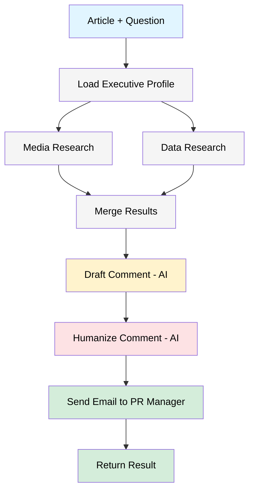

# PR Agent System

**Visual n8n automation workflow for AI-powered PR comment generation**

[](https://opensource.org/licenses/MIT)
[](https://n8n.io)

---

## Overview

The PR Agent System automates the research and drafting that branding-agency executives typically perform when responding to media requests. A visual n8n workflow orchestrates multiple AI agents to generate well-researched, on-brand, and human-sounding PR comments.

### Key Features

- ✅ **Visual Workflow Design** - See and modify the entire pipeline graphically in n8n
- ✅ **No-Code/Low-Code** - Easy maintenance without programming expertise
- ✅ **Production-Ready** - Built-in monitoring, retries, and error handling
- ✅ **Zero Infrastructure** - Deploy on n8n Cloud with no servers to manage
- ✅ **AI-Powered** - Uses OpenAI GPT-4o or Anthropic Claude Sonnet 4.5
- ✅ **Automated Research** - Parallel media and data research via Serper/Tavily
- ✅ **Email Notifications** - Sends comments to PR managers for approval

---

## How It Works



### Workflow Steps

1. **Executive Profile Loading** - Loads communication style, expertise, and tone preferences
2. **Media Research** - Parallel research on media outlet and journalist (Serper/Tavily)
3. **Data Research** - Parallel research for supporting statistics and citations
4. **Comment Drafting** - AI generates professional, data-backed comment
5. **Comment Humanization** - AI refines for natural flow and authentic voice
6. **Email Notification** - Sends to PR manager for approval with all context

---

## 🚀 Quick Start

### Prerequisites

- n8n Cloud account (free tier: https://n8n.io) **OR** Docker for self-hosting
- OpenAI API key OR Anthropic API key
- Serper API key OR Tavily API key
- Gmail account with App Password (or other SMTP)

### Option A: n8n Cloud (5 Minutes - No Docker!) ☁️

1. **Sign up** at https://n8n.io
2. **Import** `n8n/pr-agent-workflow.json` in the UI
3. **Configure** environment variables in Settings → Environments
4. **Add SMTP** credentials in Credentials menu
5. **Activate** workflow and copy webhook URL

👉 **[Complete Cloud Setup Guide →](n8n/CLOUD_SETUP.md)**

### Option B: Self-Hosted with Docker (10 Minutes) 🐳

```bash
cd n8n
docker-compose up -d
# Open http://localhost:5678
# Import workflow and configure credentials
```

👉 **[Complete Setup Guide →](n8n/QUICK_START.md)**

---

## Usage

### API Endpoint

Once activated, the workflow exposes a webhook:

```bash
POST https://your-instance.app.n8n.cloud/webhook/pr-agent/generate
```

### Request Format

```json
{
  "article_text": "Article content about brand building and ROI...",
  "journalist_question": "What advice would you give to CMOs?",
  "media_outlet": "Marketing Week",
  "executive_name": "Sarah Chen",
  "journalist_name": "Rachel Morrison",
  "article_url": "https://example.com/article"
}
```

**Required:** `article_text`, `journalist_question`, `media_outlet`, `executive_name`

### Response Format

```json
{
  "success": true,
  "humanized_comment": "This research validates what we've seen...",
  "drafted_comment": "Original draft for reference...",
  "media_research": { "analysis": "..." },
  "supporting_data": { "curated_data": "..." },
  "email_sent": true,
  "timestamp": "2025-01-17T12:00:00.000Z",
  "current_step": "completed"
}
```

### Example Usage

**cURL:**
```bash
curl -X POST https://your-instance.app.n8n.cloud/webhook/pr-agent/generate \
  -H "Content-Type: application/json" \
  -d @request.json
```

**Python:**
```python
import requests

response = requests.post(
    "https://your-instance.app.n8n.cloud/webhook/pr-agent/generate",
    json={
        "article_text": "...",
        "journalist_question": "...",
        "media_outlet": "Marketing Week",
        "executive_name": "Sarah Chen"
    }
)

result = response.json()
print(result["humanized_comment"])
```

---

## Executive Profiles

Executive profiles define communication style, expertise, and personality. They ensure consistent voice across all media interactions.

### Example Profile Structure

```json
{
  "name": "Sarah Chen",
  "title": "Chief Brand Officer",
  "company": "BrandForward Agency",
  "expertise": ["Brand strategy", "Marketing ROI"],
  "communication_style": "Professional yet approachable, data-driven",
  "tone": "Confident, insightful, forward-thinking",
  "talking_points": ["Long-term brand building", "Data-driven decisions"],
  "do_not_say": ["Empty buzzwords", "Unsubstantiated claims"]
}
```

### Using Profiles in n8n Cloud

**Option 1: Inline (Quick)**
- Copy profile JSON into the function node
- See `n8n/QUICK_START.md#step-6` for example

**Option 2: GitHub (Production)**
- Host profiles in GitHub repository
- Fetch via HTTP Request node

**Option 3: Cloud Storage**
- Upload to S3/Google Cloud Storage
- Use HTTP Request node with URLs

See `pr_agent/config/executive_profiles/` for example profiles.

---

## Configuration

### Environment Variables

Set these in n8n Cloud (Settings → Environments) or in `.env` for self-hosted:

```env
# LLM Provider (choose one)
OPENAI_API_KEY=sk-proj-...
ANTHROPIC_API_KEY=sk-ant-...

# Search Provider (choose one)
SERPER_API_KEY=...
TAVILY_API_KEY=...

# Email (required)
EMAIL_FROM=your-email@gmail.com
EMAIL_PASSWORD=your_gmail_app_password
PR_MANAGER_EMAIL=manager@company.com
```

### SMTP Credentials

Configure in n8n UI (Credentials → SMTP):
- **Host**: smtp.gmail.com
- **Port**: 587
- **SSL/TLS**: Enable
- **User**: Your email
- **Password**: App password (not regular password)

---

## Documentation

### Core Documentation
- **[Quick Start Guide](n8n/QUICK_START.md)** - Set up in 5-10 minutes
- **[Cloud Setup Guide](n8n/CLOUD_SETUP.md)** - Deploy on n8n Cloud (no Docker)
- **[Complete README](n8n/README.md)** - Full workflow documentation
- **[Migration Guide](n8n/MIGRATION_GUIDE.md)** - Migrate from Python to n8n

### Implementation Details
- **[N8N Implementation](N8N_IMPLEMENTATION.md)** - Architecture overview
- **[Executive Profiles](pr_agent/config/executive_profiles/README.md)** - Profile guide

---

## Architecture

### n8n Workflow Nodes

| Node | Type | Purpose |
|------|------|---------|
| Webhook Trigger | Webhook | API endpoint entry point |
| Load Executive Profile | Function | Loads profile from JSON |
| Media Research | HTTP Request | Calls Serper/Tavily API |
| Data Research | HTTP Request | Calls Serper/Tavily API (parallel) |
| Merge Research Results | Function | Combines parallel results |
| Draft Comment | HTTP Request | Calls OpenAI/Anthropic |
| Humanize Comment | HTTP Request | Calls OpenAI/Anthropic |
| Send Email | Email | SMTP delivery |
| Prepare Response | Function | Formats JSON response |
| Webhook Response | Respond to Webhook | Returns result |

### Technology Stack

- **n8n** - Visual workflow automation platform
- **OpenAI GPT-4o** or **Anthropic Claude Sonnet 4.5** - LLM for comment generation
- **Serper** or **Tavily** - Web search APIs for research
- **SMTP** (Gmail) - Email delivery

---

## Monitoring & Debugging

### Execution History

View all workflow runs in n8n UI:
1. Click **"Executions"** (left sidebar)
2. See status, timing, input/output for each run
3. Click any execution for detailed logs

### Common Issues

| Issue | Solution |
|-------|----------|
| "Environment variable not found" | Add in Settings → Environments |
| "SMTP authentication failed" | Use App Password, not regular password |
| "Profile not found" | Check inline profile or external URL |
| "LLM API error" | Verify API key and credits |
| "Webhook returns 404" | Ensure workflow is Active |

---

## Production Deployment

### n8n Cloud (Recommended)

✅ **Free Tier**: 20 workflows, 2,500 executions/month
✅ **Pro**: $20/month, unlimited workflows
✅ **No infrastructure**: Zero server management
✅ **Auto-scaling**: Handles traffic spikes automatically

### Self-Hosted

For advanced users who need full control:

```bash
# Production deployment with PostgreSQL, Redis, nginx
cd n8n
docker-compose --profile production up -d
```

See `n8n/README.md` for production setup details.

---

## Pricing

### n8n Cloud
- **Free**: 2,500 executions/month
- **Pro**: $20/month + API costs

### API Costs (per comment)
- **OpenAI GPT-4o**: ~$0.03-0.10
- **Anthropic Claude**: ~$0.03-0.08
- **Serper/Tavily**: ~$0.001
- **SMTP (Gmail)**: Free

**Total: ~$0.05-0.15 per comment**

---

## Examples

### Basic Request

```bash
curl -X POST https://your-n8n.app.n8n.cloud/webhook/pr-agent/generate \
  -H "Content-Type: application/json" \
  -d '{
    "article_text": "Recent research shows brands investing in long-term brand building see 3x better ROI...",
    "journalist_question": "What advice would you give to CMOs?",
    "media_outlet": "Marketing Week",
    "executive_name": "Sarah Chen"
  }'
```

### Python Integration

```python
import requests

class PRAgentClient:
    def __init__(self, webhook_url):
        self.webhook_url = webhook_url

    def generate_comment(self, article_text, question, outlet, executive):
        response = requests.post(self.webhook_url, json={
            "article_text": article_text,
            "journalist_question": question,
            "media_outlet": outlet,
            "executive_name": executive
        })
        return response.json()

# Usage
client = PRAgentClient("https://your-n8n.app.n8n.cloud/webhook/pr-agent/generate")
result = client.generate_comment(
    article_text="...",
    question="What's your perspective?",
    outlet="Forbes",
    executive="Sarah Chen"
)

print(result["humanized_comment"])
```

---

## Roadmap

### ✅ Completed
- Visual n8n workflow implementation
- Cloud deployment support (n8n Cloud)
- Parallel research execution
- Email notifications
- Executive profile system

### 🚧 In Progress
- Webhook authentication
- Redis caching for cost reduction
- Multi-language support

### 📋 Planned
- A/B testing for comment variations
- CRM integrations (Salesforce, HubSpot)
- Analytics dashboard
- Mobile approval interface
- Slack/Discord notifications

---

## Contributing

Contributions welcome! Areas to contribute:

- Additional profile examples
- Workflow optimizations
- Documentation improvements
- Integration examples
- Testing scenarios

---

## Support

- **n8n Setup**: https://docs.n8n.io
- **Community**: https://community.n8n.io
- **Issues**: GitHub Issues in this repository
- **Documentation**: See `n8n/` directory

---

## License

MIT License - see `LICENSE` for full text.
Copyright (c) 2025 CyberNexCorps.

---

## Acknowledgments

- n8n team for the amazing workflow automation platform
- Anthropic for Claude AI capabilities
- OpenAI for GPT models
- Serper and Tavily for search APIs

---

## Related Projects

- [n8n](https://n8n.io) - Workflow automation platform
- [LangChain](https://langchain.com) - LLM application framework
- [OpenAI](https://openai.com) - GPT models
- [Anthropic](https://anthropic.com) - Claude models

---

**⭐ Star this repository if you find it useful!**

**🚀 Get started in 5 minutes:** [n8n/QUICK_START.md](n8n/QUICK_START.md)
